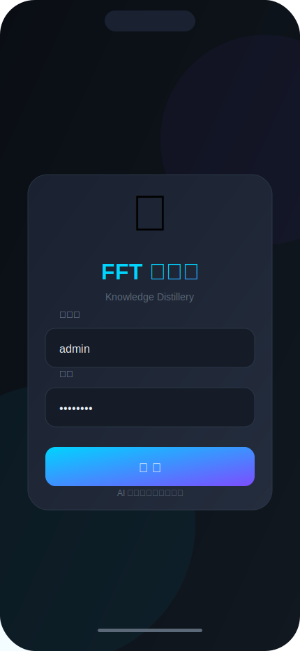
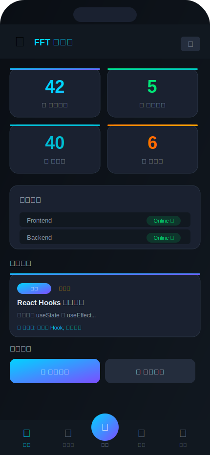
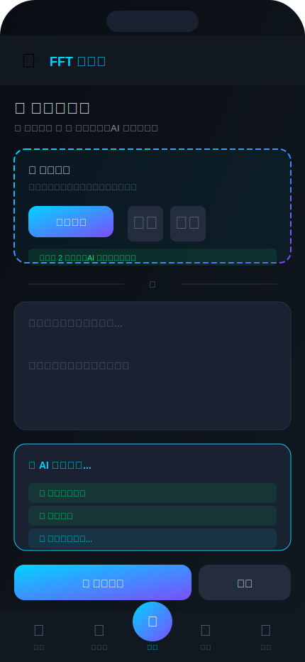
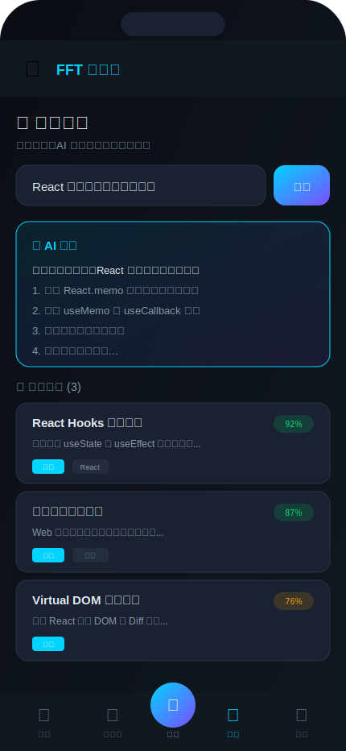

<p align="center">
  
</p>

<h1 align="center">🐕 FFT 狗腿子</h1>
<h3 align="center">Knowledge Distillery - AI 驱动的知识蒸馏系统</h3>

<p align="center">
  <a href="#功能特性">功能特性</a> •
  <a href="#快速部署">快速部署</a> •
  <a href="#使用指南">使用指南</a> •
  <a href="#技术架构">技术架构</a> •
  <a href="#api-文档">API 文档</a> •
  <a href="docs/landing.html">🌐 Landing Page</a>
</p>

<p align="center">
  
  
  
  
  
</p>

---

## 📖 项目简介

**FFT 狗腿子** (Knowledge Distillery) 是一个 AI 驱动的知识管理系统，能够自动将复杂的内容（文本、截图、代码等）**蒸馏**成结构化的知识卡片。

### 🎯 核心理念

```
📄 原始内容 → 🤖 AI 分析 → 🧪 知识蒸馏 → 📚 结构化知识卡片
```

无论是一段代码、一篇文章、还是一张开源项目的截图，系统都能自动提取：
- 📝 核心摘要
- 💡 关键要点
- 🏷️ 智能标签
- 💻 使用示例
- 🚀 部署指南

---

## ✨ 功能特性

### 🔥 智能蒸馏

| 功能 | 描述 |
|------|------|
| 📷 **截图分析** | 上传截图，AI 自动识别并提取内容 |
| 📝 **文本蒸馏** | 粘贴任意文本，自动生成结构化摘要 |
| 🔗 **开源识别** | 自动识别开源项目，提取仓库地址和部署指南 |
| 🏷️ **智能标签** | AI 自动生成相关标签，便于分类检索 |

### 🔍 语义搜索

```
用户提问 → 向量检索 → 相关知识 → AI 生成回答
```

- 基于 **pgvector** 的向量相似度搜索
- AI 根据知识库内容生成精准回答

### 📊 知识图谱

可视化展示知识点之间的关联关系，包括：
- 分类聚合视图
- 标签云
- 相关知识推荐

### 📧 邮件报告

自动发送每日/每周知识摘要邮件，包含：
- 新增知识统计
- 今日亮点
- 知识关联分析

---

## 🖼️ 界面预览

### 移动端界面 (iPhone 16 Pro Max 适配)

<p align="center">
  
  
  
  
</p>

| 登录页面 | 仪表盘 | 添加知识 | 智能搜索 |
|:---:|:---:|:---:|:---:|
| 简洁的赛博朋克风格登录界面 | 知识库统计与系统状态概览 | 截图上传与 AI 自动分析 | AI 问答与语义搜索结果 |

---

## 🏗️ 技术架构

<p align="center">
  
</p>

### 技术栈详情

| 层级 | 技术 | 说明 |
|------|------|------|
| **前端** | React 18 + TypeScript | 移动优先的响应式 UI |
| **构建** | Vite | 快速开发热重载 |
| **后端** | FastAPI (Python 3.11) | 异步 API 框架 |
| **数据库** | PostgreSQL 16 + pgvector | 向量相似度搜索 |
| **AI** | Claude 3.5 Sonnet (OpenRouter) | 知识蒸馏 & 图片分析 |
| **容器** | Docker Compose | 一键部署 |

---

## 🚀 快速部署

### 系统要求

- 🐳 Docker & Docker Compose
- 💾 2GB+ RAM
- 💽 10GB+ 磁盘空间
- 🌐 开放端口: 5173, 8000, 5432

### 一键部署

```bash
# 1. 克隆仓库
git clone https://github.com/bkcsplayer/knowledge-card.git
cd knowledge-card

# 2. 配置环境变量
cp .env.example .env

# 3. 编辑 .env 文件，填入你的配置
nano .env

# 4. 启动所有服务
docker-compose up -d --build

# 5. 查看运行状态
docker-compose ps
```

### 环境变量配置

创建 `.env` 文件：

```bash
# ================================
# 数据库配置
# ================================
POSTGRES_USER=kd_user
POSTGRES_PASSWORD=your_strong_password
POSTGRES_DB=knowledge_distillery

# ================================
# OpenRouter AI 配置 (必填)
# ================================
OPENROUTER_API_KEY=sk-or-v1-your-api-key
OPENROUTER_MODEL=anthropic/claude-3.5-sonnet

# ================================
# 邮件配置 (可选)
# ================================
SMTP_HOST=smtp.example.com
SMTP_PORT=587
SMTP_USER=your@email.com
SMTP_PASSWORD=your_password
EMAIL_RECIPIENTS=recipient@example.com
```

### 访问服务

| 服务 | 地址 | 说明 |
|------|------|------|
| 🌐 前端 | http://YOUR_IP:5173 | Web 界面 |
| 📡 API | http://YOUR_IP:8000 | 后端接口 |
| 📚 文档 | http://YOUR_IP:8000/docs | Swagger UI |

### 默认登录

- **用户名**: `admin`
- **密码**: `1q2w3e4R.`

---

## 📱 使用指南

### 1️⃣ 添加知识 - 截图方式

最简单的方式是直接上传截图：

1. 点击底部 ➕ 按钮
2. 选择 📷 上传截图
3. 点击 🔍 分析图片
4. AI 自动识别内容并生成知识卡片

支持的截图类型：
- 开源项目主页 / README
- 代码片段
- 技术文档
- 架构图

### 2️⃣ 添加知识 - 文本方式

1. 点击底部 ➕ 按钮
2. 在文本框粘贴内容
3. 点击 🧪 蒸馏知识
4. 查看生成的知识卡片

### 3️⃣ 智能搜索

1. 点击底部 🔍 按钮
2. 输入问题（如："React Hooks 怎么用？"）
3. AI 会根据知识库内容生成回答
4. 同时展示相关知识卡片

### 4️⃣ 知识图谱

1. 点击底部 📊 按钮
2. 查看按分类聚合的知识点
3. 点击标签云中的标签快速筛选
4. 探索知识之间的关联

---

## 📡 API 文档

完整 API 文档请访问 `/docs`，这里是常用接口：

### 创建知识

```bash
# 文本方式
curl -X POST http://localhost:8000/api/v1/knowledge/ \
  -H "Content-Type: application/json" \
  -d '{
    "content": "你的知识内容...",
    "auto_process": true
  }'

# 图片方式 (先上传图片)
curl -X POST http://localhost:8000/api/v1/upload/image \
  -F "file=@screenshot.png"

# 然后用图片路径创建知识
curl -X POST http://localhost:8000/api/v1/knowledge/ \
  -H "Content-Type: application/json" \
  -d '{
    "content": "",
    "images": ["/api/v1/upload/images/xxx.png"],
    "source_type": "image",
    "auto_process": true
  }'
```

### 搜索知识

```bash
curl -X POST http://localhost:8000/api/v1/search/ \
  -H "Content-Type: application/json" \
  -d '{
    "query": "如何优化 React 性能？",
    "limit": 10,
    "include_answer": true
  }'
```

### 获取统计

```bash
curl http://localhost:8000/api/v1/knowledge/stats
```

更多 API 详情请查看 [API_DOCUMENTATION.md](./API_DOCUMENTATION.md)

---

## 🗂️ 项目结构

```
knowledge-card/
├── 📁 backend/                 # FastAPI 后端
│   ├── 📁 models/              # 数据库模型
│   ├── 📁 routers/             # API 路由
│   ├── 📁 services/            # 业务逻辑
│   │   ├── ai_service.py       # AI 蒸馏 & 图片分析
│   │   ├── knowledge_service.py
│   │   └── embedding_service.py
│   ├── main.py                 # 应用入口
│   ├── config.py               # 配置管理
│   ├── database.py             # 数据库连接
│   ├── Dockerfile
│   └── requirements.txt
│
├── 📁 frontend/                # React 前端
│   ├── 📁 src/
│   │   ├── App.tsx             # 主应用
│   │   └── App.css             # 样式 (移动优先)
│   ├── index.html
│   ├── Dockerfile
│   └── package.json
│
├── 📁 docs/                    # 文档资源
│   └── 📁 images/              # 项目图片
│
├── 📁 uploads/                 # 上传文件存储
│
├── docker-compose.yml          # Docker 编排
├── .env.example                # 环境变量模板
├── API_DOCUMENTATION.md        # API 文档
└── README.md                   # 本文件
```

---

## 🔧 开发指南

### 本地开发

```bash
# 启动开发环境 (带热重载)
docker-compose up --build

# 查看日志
docker-compose logs -f backend
docker-compose logs -f frontend

# 重建单个服务
docker-compose build --no-cache backend
docker-compose up -d backend
```

### 代码热重载

- **前端**: 修改 `frontend/src/` 下的文件，浏览器自动刷新
- **后端**: 修改 `backend/` 下的 Python 文件，Uvicorn 自动重载

---

## ❓ 常见问题

### Q: AI 服务报错？

确保 `.env` 中正确配置了 `OPENROUTER_API_KEY`

### Q: 图片分析失败？

1. 检查图片是否清晰可读
2. 确保使用的是 Claude 3.5 Sonnet 模型（支持 Vision）
3. 查看后端日志: `docker-compose logs backend`

### Q: 数据如何备份？

```bash
# 备份数据库
docker-compose exec db pg_dump -U kd_user knowledge_distillery > backup.sql

# 恢复数据库
docker-compose exec -T db psql -U kd_user knowledge_distillery < backup.sql
```

---

## 📜 许可证

MIT License - 自由使用和修改

---

## 🙏 致谢

- [OpenRouter](https://openrouter.ai/) - AI API 网关
- [Claude](https://www.anthropic.com/) - AI 模型
- [FastAPI](https://fastapi.tiangolo.com/) - 后端框架
- [React](https://react.dev/) - 前端框架
- [pgvector](https://github.com/pgvector/pgvector) - 向量搜索

---

<p align="center">
  Made with ❤️ by FFT Team
</p>
